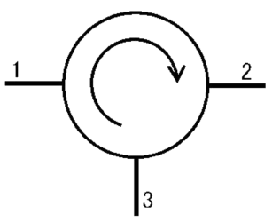
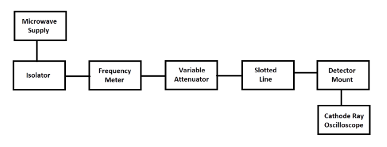
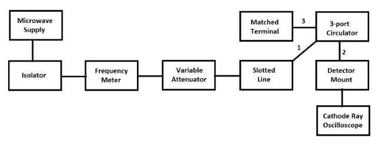
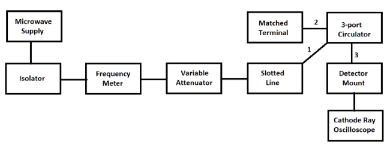

### Introduction

A circulator is a device that transports radio frequency or microwave signals from one port to another. They typically have three ports. They are made of magnets and ferrite materials with magnetic properties. Circulators can be made to circulate clockwise or counterclockwise. So the name "circulator" makes sense in that it transmits the signal around to the three ports. These devices are also referred to as duplexers because they allow the transmission of two signals over one channel. This allows a receiver and a transmitter to share the same antenna. This is the most common use for a circulator. When the transmitter sends a signal, the device directs the signal to the antenna port. So in summary, a circulator is a device that is designed to direct radio frequencies or microwave signals from Port 1 to Port 2 with a minimum loss. Following is the basic parameters of circulator for study.  

**Fig. 1 Circulator**

1.  The coupling factor is defined as:  

$$
Coupling (dB) ={20log_{10}} \frac{V1}{V3}
$$
 

  
2.  It is the ratio of power fed to input arm to the input power detected at not coupled port with other port terminated in the matched load.  
    Hence
    

$$
Isolation (dB) ={20log_{10}} \frac{V1}{V3}
$$
 

### Block Diagram

*   ### **For V1 Voltage:**
    

    
    
    **Fig. 2 Bench setup for V1 Voltage**
    

    
*   ### **For V2 Voltage:**
    

    
    
    
    **Fig. 3 Bench setup for V2 Voltage**
    

    
*   ### **For V3 Voltage:**
    

    
    
    **Fig. 4 Bench setup for V3 Voltage**
    

